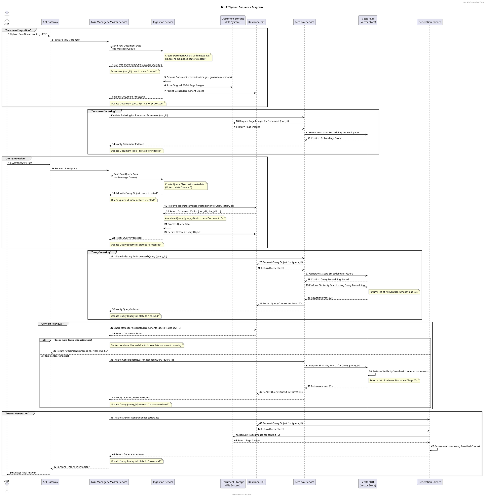

# DocAI System Development & Implementation Prompt

We are developing **DocAI**, a retrieval-augmented generation (RAG) system, and our final system sequence diagram is attached below. This diagram divides the system's end-to-end flow into six key phases:

1. **Document Ingestion**
   - **User Interaction:** Users upload raw documents (e.g., PDFs) via the API Gateway.
   - **Flow:** The API Gateway forwards the raw document to the Task Manager, which in turn (via asynchronous messaging) sends the raw document data to the Ingestion Service.
   - **Processing:** The Ingestion Service creates a full Document object (generating an ID and extracting metadata), processes the document (e.g., converts it to page images), stores files in the Document Storage (a file system), and persists details in the Relational DB.
   - **State Updates:** The Task Manager records state transitions for the document from "created" to "processed".

2. **Document Indexing**
   - **Flow:** The Task Manager instructs the Retrieval Service to index the processed document.
   - **Processing:** The Retrieval Service requests page images from Document Storage, generates embeddings (using the Vector DB) for each document page, and updates the document state to "indexed" via notification to the Task Manager.

3. **Query Ingestion**
   - **User Interaction:** Users submit query text via the API Gateway.
   - **Flow:** The API forwards the raw query to the Task Manager, which then sends it (using asynchronous messaging) to the Ingestion Service.
   - **Processing:** The Ingestion Service creates a full Query object (with a unique ID), processes the query (enrichment, validation), and persists detailed records in the Relational DB. Additionally, the system associates the query with the set of Document IDs available at query creation.
   - **State Updates:** The Task Manager records state transitions for the query from "created" to "processed".

4. **Query Indexing**
   - **Flow:** The Task Manager instructs the Retrieval Service to index the processed query.
   - **Processing:** The Retrieval Service retrieves the Query object from the RDB, generates and stores a query embedding (via the Vector DB), performs a similarity search to identify the relevant Document/Page IDs, and persists the retrieved context in the RDB.
   - **State Updates:** The query’s state is updated to "indexed" by the Task Manager.

5. **Context Retrieval**
   - **Verification:** The Task Manager checks that all Documents associated with the query (tracked during Query Ingestion) are in the "indexed" state by querying the RDB.
   - **Processing:** If one or more Documents are not yet indexed, the system responds with a “Documents processing. Please wait…” message. If all associated Documents are indexed, the Task Manager retrieves the full Query Context and updates the query state to "context-retrieved".

6. **Answer Generation**
   - **Flow:** Once the query is in the "context-retrieved" state, the Task Manager initiates the answer generation phase by invoking the Generation Service.
   - **Processing:** The Generation Service retrieves the Query Context and the corresponding page images from the Document Storage, generates the final answer (using an LLM or prompt-based system), and returns this answer to the Task Manager.
   - **State Updates:** The Task Manager updates the query state to "answered" and the final answer is delivered back to the user via the API Gateway.

### Final Sequence Diagram (DocAI)



## Additional Project Structure Overview

Below is the current project structure for DocAI. Note that this structure was developed prior to our full system view and may be updated as our implementation evolves:

```
.
├── config
│   └── config.yaml
├── data
│   ├── documents
│   │   └── doc_5b871ed6-182e-40f8-aacd-a859adc796a9.json
│   ├── images
│   │   ├── doc_5b871ed6-182e-40f8-aacd-a859adc796a9_p0.jpg
│   │   ├── ... (other page images)
│   └── pdfs
│       └── zong-woo-geem-et-al-2001-a-new-heuristic-optimization-algorithm-harmony-search.pdf
├── docs
│   ├── system_sequence_diagram.pdf
│   └── system_sequence_diagram.plantuml
├── logs
│   └── ingest.log
├── poetry.lock
├── pyproject.toml
├── README.md
├── scripts
│   └── hf_downloader.py
├── src
│   └── docai
│       ├── answer-generation
│       ├── api
│       │   ├── endpoints
│       │   │   ├── documents.py
│       │   │   ├── ingestion.py
│       │   │   └── __init__.py
│       │   └── models
│       │       ├── __init__.py
│       │       └── schema.py
│       ├── benchmarking
│       ├── config.py
│       ├── ingestion
│       │   ├── id_generator.py
│       │   ├── ingest.py
│       │   ├── __init__.py
│       │   ├── models.py
│       │   ├── pdf_to_jpg.py
│       │   └── __pycache__
│       │       ├── id_generator.cpython-312.pyc
│       │       ├── __init__.cpython-312.pyc
│       │       ├── models.cpython-312.pyc
│       │       └── pdf_to_jpg.cpython-312.pyc
│       ├── __init__.py
│       ├── __pycache__
│       │   ├── config.cpython-312.pyc
│       │   └── __init__.cpython-312.pyc
│       ├── question-processing
│       ├── retreival
│       └── utils
│           ├── logging_utils.py
│           └── __pycache__
│               └── logging_utils.cpython-312.pyc
└── tests
    └── __init__.py

24 directories, 40 files
```


## Implementation Requirements & Considerations

- **Service Deployment:**
- **Always-On Services:** The API Gateway, Task Manager, Relational DB, and Vector DB must run as long-lived processes on dedicated nodes/ports.
- **Processing Services:** The Ingestion, Retrieval, and Generation services also run continuously (as containerized daemons) and handle work asynchronously via message queues.

- **State Management:**
- The Task Manager records state transitions for both Document and Query objects based on explicit acknowledgments.
- The Ingestion Service is responsible for ID generation and object creation.

- **Data Persistence:**
- Detailed Document and Query records are stored in the Relational DB.
- Document page embeddings are stored in the Vector DB.
- Original PDFs and image files are maintained in the Document Storage (file system).

- **Flow Verification and Error Handling:**
- Before generating an answer, the system verifies that all Documents associated with a Query have reached the "indexed" state.
- If not, the system responds with “Documents processing. Please wait…”
- Robust error-handling should be implemented for processing failures, network errors, and message queue issues.

- **Inter-service Communication:**
- Communication between services is asynchronous, leveraging message queues (e.g., RabbitMQ or Kafka) to decouple workloads.
- RESTful APIs define the synchronous endpoints for user interaction.

- **Scalability & Monitoring:**
- Ensure that processing services can scale horizontally.
- Implement centralized logging and monitoring (e.g., ELK, Prometheus, Grafana) to track system performance and state transitions.


## Next Steps

Develop a detailed implementation plan and system design document for DocAI that includes:

- Service responsibilities and API specifications.
- State management and inter-service communication workflows.
- Deployment strategies on the HPC cluster (or the chosen infrastructure) with considerations for scalability, fault tolerance, and monitoring.
- Detailed error-handling and logging strategies.
